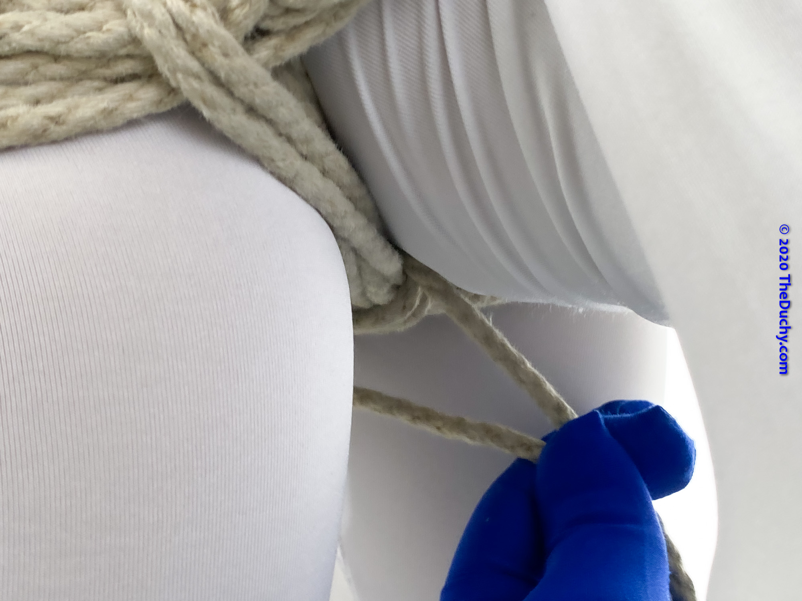

# [Doggy Style Harness - TheDuchy](https://www.theduchy.com/doggy-style-harness/#pics)

-  1.	If you want your partner’s ass to be protruding for your scene – great for a long-term spanking or for… other things – there is an easy way to tie them in this position")
-  2.	You just tie them into a giant double column, with the torso being one side of the column and the legs being the other side.  For this tutorial I will use the Lark’s Head Double Column")
-  3.	I usually like to start them a little bit more bent over because once the tie is done there is usually a bit of wriggling they can do to get a few more degrees of freedom out of it.")
-  4.	As with any other Lark’s Head Double Column, wrap it around, put your fingers through the bight, and grab the tail")
-  5.	Pull the tail through and reverse tension.  You want to have the bight be positioned at the waist between the legs and the torso")
-  6.	Do one wrap around your partner.  Note that this strap is still relatively thin for the size of the things that we’re trying to tie, so I usually like to go around one more time…")
-  7.	…  Like this.  This distributes the force across a wider area and makes the tie a bit more comfortable for longer-term wear")
-  8.	Put your fingers through the secondary bight and grab the tail")
-  9.	Pull it through and run the tail to your partner’s other side.  Now we’re going to add the cinch.  (If we were tying a Lark’s Head Double Column on to the wrists this is the part that would go between the wrists.  But as we’re tying it here, this one goes between the torso and legs all the way to the other side.)")
-  10.	On the other side, reach between the strap and your partner and pull the tail up and through")
-  11.	This is a relatively wide strap, so we need to give it a little assistance or it will bunch up when we  only add tension to the cinch.  To do that, grab all of the strands between your thumb and forefinger…")
-  12.	…  And then angle the whole strap toward the incoming cinch line") _I have twisted the whole strap here so it faces up instead of out_
-  13.	Keep the cords of the strap parallel and even while you lay the cinch line tightly across them")
-  14.	Reverse the tension…")
-  15.	…And bring the tail back to your partner’s other side")
-  16.	Reach under the strap to grab the tail …")
-  17.	… Pull it through and reverse the tension.  Provide the same support to the strap on this side as you did on the other side to keep it from bunching up too much")
-  18.	Bring the tail to the other side (left side in this case) and do one more cinch wrap on that side Note that if you’re out of rope, you can tie an off here and this harness will still work pretty well.  But if you still have rope, you can keep on going to add an additional cinch between the waist strap and legs")
-  19.	If you’re going to add the between-the-legs cinch, reverse tension from the left hand side and this time bring it down in between-the-legs instead") _If you would like the tail to be coming straight from the waistband before you start doing the leg cinch (I always do this), run the tail to the middle of the waist band then add a half-hitch first before bringing the tail between the legs. In the video, I show how to do this in detail_
-  20.	Place your hand between their legs and above the strap (this is obviously a marvelous time to mess with them if you want to) …")
-  21.	… And grab the tail like this")
-  22.	Pull the tail through and then keep your strap neatly parallel while you place the cinch across the strap…")
-  23.	…  And add tension")
-  24.	Bring the tail forward toward the waist band")
-  25.	Run your fingers between the waistband and your partners torso to grab the tail")
-  26.	(Here’s a closer shot of that)")
-  27.	Pull the tail through, reverse tension back through the legs")
-  28.	The tail will naturally be coming below the leg strap so…")
-  29.	Put your fingers above the strap to grab the tail and pull it through")
-  30.	Again, reverse tension")
-  31.	And again, bring to the waist strap")
-  32.	This is a decent place to end it if you’re out of rope.  If you’d like to tie off here, you can do it one of a couple ways.  The first way is to tie off with a Square Knot.  To do that, run one of the lines between the waist strap and your partner’s torso, while leaving the other line on the other side.  It will look like this")
-  33.	Then just tie off with a Square Knot")
-  34.	Alternatively, you can tie off with a series of half hitches.")
-  35.	If you have a little more line like I do, you can bring the tail back out to the side")
-  36.	Run it under the band")
-  37.	And then lock it off with a few half-hitches")
-  38.	Tuck any remaining ends under the band and you’re done!")
-  << I wonder what possibilities exist from here…  >>")
-  Just as a quick demo, if my partner is pulled forward, their ass still stays very much sticking out")
-  Even if they reach above them and try to pull themselves up, they stay provocatively bent")

